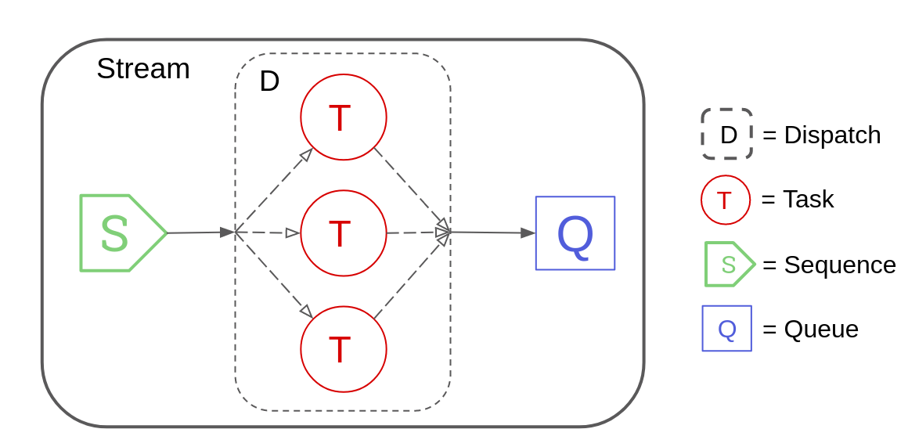

# Stream
Stream is a Swift library that enables you to create scalable data pipelines for medium or large datasets.

## Features
Stream pipelines allow you to process large or even infinite collections efficiently by:
* Performing computation in parallel within each Stream.
* Running each Stream concurrently within a pipeline.
* Providing back-pressure mechanisms to control memory growth.

## Installation
You can install it via SwiftPM via:
```swift
.package(url: "https://github.com/cgarciae/Stream", from: "0.0.7")
```
It might work on other compatible package managers.

## Example
Any `Sequence` can be converted into a `Stream` via the `.stream` property, after that you can use its custom functional methods like `map`, `filter`, etc, to process the data in parallel / concurrently:
```swift
import Stream

_ = getURLs()
    .stream
    .map {
        downloadImage($0)
    }
    .filter {
        validateImage($0)
    }
    .flatMap {
        getMultipleImageSizes($0)
    }
    .forEach {
        storeImage($0)
    }
```
`Stream` inherits from `LazySequence` so you can treat it like a normal Sequence for other purposes. By default the results of each stream may come in any order which has better performance, but if you do want to preserve order you can turn a `Stream` into an `OrderedStream` via the `.inOrder` property. 

```swift
import Stream

_ = getURLs()
    .stream
    .inOrder
    .map {
        downloadImage($0)
    }
    .filter {
        validateImage($0)
    }
    .flatMap {
        getMultipleImageSizes($0)
    }
```

#### Back-pressure
To manage resources you can use the `maxTasks` and `queueMax` parameters: 
```swift
import Stream

_ = getURLs()
    .stream
    .map(maxTasks: 4, queueMax: 10) {
        downloadImage($0)
    }
    .filter(maxTasks: 2, queueMax: 15) {
        validateImage($0)
    }
    .flatMap(maxTasks: 5, queueMax: 25) {
        getMultipleImageSizes($0)
    }
    .forEach(maxTasks: 3,queueMax: 20) {
        storeImage($0)
    }
```
`maxTasks` will control the number of GCD Tasks created by the Stream, and `queueMax` will limit maximum amount of elements allowed to live in the output queue simultaneously. If the output queue is full tasks will eventually block and the Stream will halt until its consumer requests more elements.

## Architecture

## Members
* `map`
* `flatMap`
* `filter`
* `forEach`


## Meta
Cristian Garcia – cgarcia.e88@gmail.com

Distributed under the MIT license. See LICENSE for more information.
